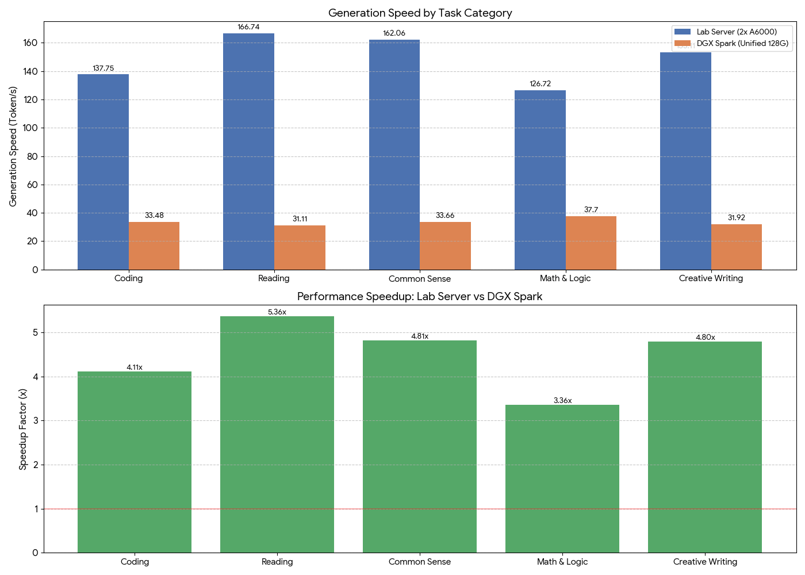

# GPT-OSS-120B 推理性能评测：实验室服务器 vs DGX Spark

## 1. 基础环境与方法

本次评测旨在量化评估 120B 参数规模的大语言模型（`gpt-oss-120b`）在不同硬件架构下的推理性能。测试重点在于对比**高带宽显存架构**（实验室服务器）与**统一内存架构**（DGX Spark）在实际生成任务中的吞吐表现。

### 1.1 硬件环境
* **实验室服务器 (Lab Server)**
    * **显卡**：2x NVIDIA RTX A6000
    * **显存**：96GB GDDR6 (48GB x 2)
    * **带宽**：**1536 GB/s** (单卡 768 GB/s x 2)
* **DGX Spark**
    * **内存架构**：统一内存 (Unified Memory)
    * **内存容量**：128GB
    * **带宽**：**273 GB/s**

### 1.2 软件与模型配置
* **模型**：  GPT-OSS-120B
* **推理引擎**：vLLM
* **测试方法**：
    * 选取 5 个典型应用场景：编程问题、阅读理解、常识推理、数学逻辑、创意写作。 
    * 每个场景连续运行 5 个不同提示词（Prompt），记录生成速度（Token/秒）与总耗时。 
    * 实验室版开启多卡并行（Tensor Parallelism），Spark 版使用单节点统一内存调度。

---

## 2. 核心测试结论

测试结果表明，显存带宽是 120B 模型推理速度的决定性瓶颈。**实验室双卡方案相比 DGX Spark 实现了 4.45 倍的整体加速。**

| 核心指标 | 实验室服务器 (2x A6000) | DGX Spark (统一内存) | 性能差异 |
| :--- | :--- | :--- | :--- |
| **平均生成速度** | **149.28 Token/s** | **33.57 Token/s** | **4.45倍** |
| **最高单项速度** | 166.74 Token/s (阅读理解) | 37.70 Token/s (数学逻辑) | - |
| **最低单项速度** | 126.72 Token/s (数学逻辑) | 31.11 Token/s (阅读理解) | - |

---

## 3. 详细性能数据分析

### 3.1 各场景性能对比

以下为五大测试场景的具体实测数据（单位：Token/秒）：

| 测试场景 | 实验室服务器 (A6000双卡) | DGX Spark (统一内存) | 加速倍数 | 备注 |
| :--- | :--- | :--- | :--- | :--- |
| **阅读理解** | **166.74** | 31.11  | **5.36x** | 上下文吞吐量大，带宽优势最明显 |
| **常识推理** | 162.06  | 33.66  | 4.81x | - |
| **创意写作** | 153.11  | 31.92  | 4.80x | - |
| **编程问题** | 137.75  | 33.48  | 4.11x | - |
| **数学逻辑** | 126.72  | **37.70**  | 3.36x | 计算密集型任务，带宽瓶颈略微减弱 |

### 3.2 性能可视化

*图注：蓝色柱状图代表实验室服务器速度，橙色代表 DGX Spark 速度。绿色折线代表两者之间的加速倍数。*

---

## 4. 瓶颈深度分析

本次测试清晰地展示了 **Memory Bandwidth Bound（显存带宽受限）** 现象。

1.  **理论带宽与实际性能的强相关性**：
    * 实验室服务器的总带宽（1536 GB/s）是 DGX Spark（273 GB/s）的 **5.6 倍**。
    * 实验室服务器的实际平均速度（149 Token/s）是 DGX Spark（33.6 Token/s）的 **4.45 倍**。
    * **结论**：推理速度的提升幅度直接受限于物理带宽的提升幅度。

2.  **统一内存的局限性**：
    * DGX Spark 依靠 128GB 的大容量统一内存成功运行了 120B 模型，解决了“装不下”的问题。
    * 但在生成阶段，每输出一个 Token 都需要遍历模型权重。273 GB/s 的带宽导致数据传输跟不上计算核心的速度，使得计算单元处于“饥饿”状态，速度被钳制在 30+ Token/s。

3.  **任务特性的影响**：
    * **阅读理解**任务中，实验室版跑出了最快的 166.74 Token/s ，而这恰好是 Spark 版最慢的项目（31.11 Token/s）。这说明处理长文本时，高带宽带来的 KV Cache 访问优势被进一步放大。

---

## 5. 建议与总结

* **高性能生产环境（推荐实验室方案）**：
    对于需要高并发、低延迟的业务（如实时对话机器人、代码补全），必须采用 RTX A6000 或更高带宽的显卡集群。150 Token/s 的生成速度能够提供无感知的流畅交互体验。

* **低成本研发环境（DGX Spark 可用）**：
    DGX Spark 的 33 Token/s 虽然性能落后，但仍高于人类平均阅读速度（约 5-10 Token/s）。鉴于其大内存优势，适合用于模型调试、离线批量处理任务，或者作为 120B 以上超大模型的低成本验证平台。
