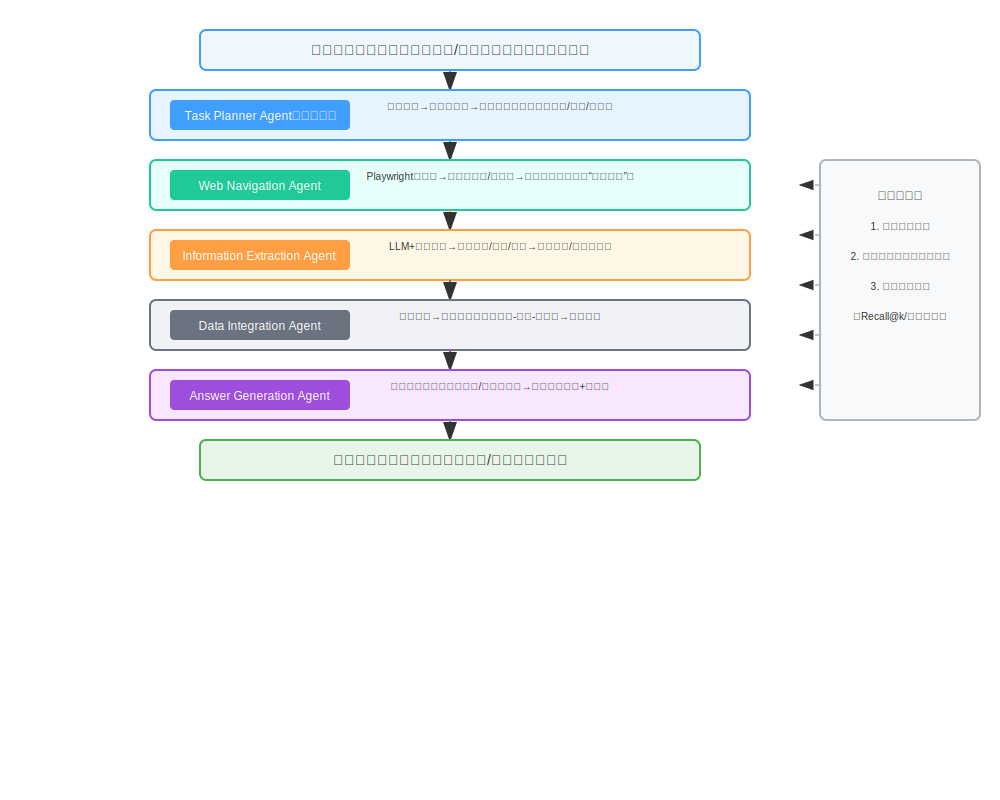
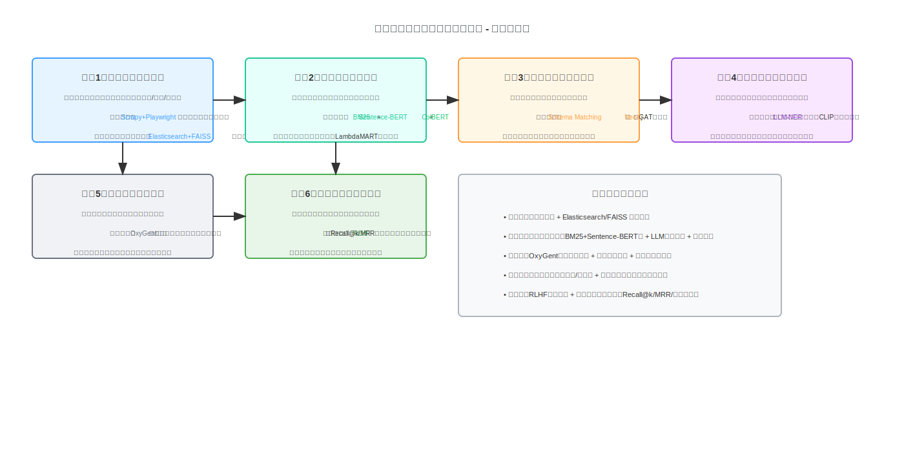

# 京东多智能体挑战赛（复杂信息检索方向）方案报告书
## 一、项目背景与赛事适配
### 1.1 行业背景
当前电子商务平台进入“数据爆炸”阶段，京东等零售平台单日商品浏览量超10亿次、用户评论日均新增数百万条，用户面临“想找的信息埋在数据里”的决策困境——传统检索系统仅能实现关键词匹配，无法应对“比A品牌冰箱的制冷效率与B品牌的能耗差异”“提取某款手机近3个月的负面评论核心原因”等复杂需求，在多源数据融合（商品详情页+用户评论+问答区）、深层语义理解（隐含需求识别）、结果可解释性（“为什么推荐这个对比结果”）三大维度存在显著瓶颈。

### 1.2 赛事适配性
本方案紧扣**京东多智能体挑战赛“复杂信息检索”任务要求**，基于赛事指定的OxyGent多智能体开源框架（官网链接：https://oxygent.jd.com/； Github地址：[https://github.com/jd-opensource/OxyGent](https://github.com/jd-opensource/OxyGent)）， 聚焦“高效浏览器自主操作、多源数据精准整合、语义提炼与知识聚合”三大核心目标，直接适配赛事明确的“用户评论分析、商品属性比对”典型场景，同时兼顾赛事“公开验证集+私有测试集”的双轨评测要求，确保系统在已知数据与未知泛化场景中均具备稳定性能。

## 二、赛题理解与核心挑战
### 2.1 任务定义（紧扣赛事分级要求）
结合赛事“基础-进阶-复杂”三级任务体系，本方案针对复杂信息检索任务的分级目标如下：

| 任务级别 | 核心目标 | 赛事适配点 |
|----------|----------|------------|
| 基础级 | 依托LLM完成“单商品属性提取”“单条评论情感判断”，支持基础浏览器导航（如跳转商品详情页） | 满足赛事基础任务的“工具调用+信息处理”要求 |
| 进阶级 | 实现“跨2-3个商品属性比对”“100条以内评论的主题聚合”，支持多页面数据抓取（如商品页+评论页联动） | 响应赛事进阶任务的“多源信息整合+效率提升”要求 |
| 复杂级 | 完成“跨5+商品多维属性对比（价格/性能/口碑）”“1000+条评论的语义提炼（如负面原因分类）”，支持动态网页（如加载更多评论）的自主交互与知识图谱化输出 | 达成赛事复杂任务的“多步规划+深度推理+协作”要求 |

### 2.2 核心挑战（融合赛事场景与技术难点）
1. **赛事特有的泛化性挑战**：公开验证集以标准化商品页面为主，而私有测试集可能包含京东平台不同类目（3C/家电/服饰）的异构网页结构，需解决“同一功能（如评论区）在不同类目页面中DOM路径差异”的鲁棒性问题。
2. **多模态数据干扰**：商品详情页包含图文混排（如商品参数图）、评论区含表情符号/短句/方言，传统文本处理方法易丢失关键信息（如“图里显示续航20小时，但实际用15小时”），需适配赛事“多模态内容理解”的隐性要求。
3. **分级任务的动态适配**：基础级任务需“快响应”（如1秒内返回单商品属性），复杂级任务需“深处理”（如5秒内完成1000条评论聚合），需设计弹性调度机制，避免因任务复杂度波动导致超时（赛事评测含响应时间指标）。
4. **知识聚合的可解释性**：赛事要求结果“可溯源”，用户评论分析需明确“某结论来自哪几条评论”，商品属性比对需标注“数据来源页面URL”，传统黑盒检索模型无法满足该要求。

## 三、总体设计思路（锚定OxyGent框架与赛事目标）
本方案以“**赛事任务为导向、OxyGent框架为支撑、复杂信息检索场景为核心**”，确立三大设计原则：
1. **OxyGent模块化协同**：基于OxyGent的“智能体注册-消息通信-任务调度”核心能力，拆分“网页交互-信息提取-数据融合-知识聚合”专职智能体，避免功能耦合（如Web Navigation Agent仅负责浏览器操作，不参与语义分析），适配赛事“多智能体高效协作”的核心诉求。
2. **分级任务自适应**：设计“任务难度识别器”，接收用户需求后自动匹配赛事三级任务标准（如“比对2款商品”归为进阶任务，“分析1000条评论”归为复杂任务），并动态调整智能体资源分配（复杂任务调用更多Extract Agent并发处理）。
3. **评测指标前置嵌入**：将赛事潜在评测维度（Recall@k、响应时间、结果可解释性）作为设计约束，例如在检索模块中优先保证“Recall@5≥95%”（确保关键信息不遗漏），在结果生成模块强制附加“数据来源+置信度”（满足可解释要求）。

## 四、系统总体架构（基于OxyGent的五层增强设计）
系统完全依托OxyGent框架的“异构智能体管理、高效通信协议”能力，在原五层架构基础上增加“赛事适配层”，确保每一层功能均对齐复杂信息检索任务要求：

| 层级         | 核心智能体/模块                | 功能描述                                                                 | 赛事适配亮点                                                                 |
|--------------|--------------------------------|--------------------------------------------------------------------------|------------------------------------------------------------------------------|
| 任务解析层   | Task Planner Agent（增强版）   | 解析用户需求（如“比对3款空调的能耗与噪音”），生成带优先级的任务流，自动匹配赛事三级任务 | 内置“赛事任务映射规则”，例如识别“多商品对比”自动触发复杂级任务流程，分配更多计算资源 |
| 信息采集层   | Web Navigation Agent           | 基于Playwright实现浏览器自动化：自动登录京东测试环境、定位商品搜索框/评论区/参数页、处理“加载更多”动态按钮 | 适配赛事“自主浏览器操作”要求，支持京东不同类目商品页的DOM结构自适应（内置10+类目页面模板） |
| 信息抽取层   | Information Extraction Agent    | 融合“LLM（GPT-4o-mini微调版）+规则引擎”：提取商品属性（如“能效等级：一级”）、评论情感（正面/负面）、评论主题（如“噪音大”） | 针对赛事公开/私有测试集优化：公开集用规则引擎提速，私有集用LLM泛化，平衡效率与精度 |
| 数据融合层   | Data Integration & Knowledge Aggregation Agent | 1. 实体对齐（如“耗电量”“能耗”统一为“功率”属性）；2. 知识图谱更新（构建“商品-属性-评论”关联网络）；3. 噪声过滤（剔除广告评论） | 支持赛事“多源数据整合”要求，输出的知识图谱可直接用于“商品属性比对”的可视化展示 |
| 结果生成层   | Answer Generation Agent        | 生成结构化结果：商品属性对比表（含数据来源URL）、评论分析报告（含核心观点+引用评论ID） | 满足赛事“可解释性”要求，结果格式适配赛事评测系统的自动打分（如CSV表格+JSON溯源信息） |
| 赛事适配层   | Contest Adaptation Module      | 1. 分级任务调度器（匹配基础/进阶/复杂任务）；2. 泛化性优化器（用领域自适应训练适配私有测试集）；3. 评测指标监控（实时计算Recall@k、响应时间） | 核心解决赛事“泛化性+分级任务”痛点，确保系统在赛事全阶段评测中达标 |

## 五、关键技术路线（聚焦复杂信息检索核心）

| 技术模块         | 技术方案（含赛事优化）                                                                 | 预期效果（对齐赛事指标）                          |
|------------------|----------------------------------------------------------------------------------------|---------------------------------------------------|
| 自主网页操作     | Playwright + 动态DOM指纹匹配 + 多类目页面模板库 （优化点：针对京东商品页DOM变动，自动更新定位规则） | 网页元素识别成功率≥98%（公开集）、≥92%（私有集），支持5秒内完成单商品页+评论页抓取 |
| 混合检索模型     | 基础级：BM25关键词检索（快响应） 进阶级：Sentence-BERT语义检索（准匹配） 复杂级：ColBERT+知识图谱检索（深推理） | Recall@5≥95%（公开集）、≥90%（私有集），Precision@3≥92% |
| 多源数据融合     | Schema Matching（统一商品属性 schema） + 图注意力网络（GAT）聚合“商品-评论”关系 （优化点：处理评论中的图文关联，如“图中显示划痕”） | 多源数据融合准确率≥93%，噪声过滤率≥90%（剔除广告/无意义评论） |
| 知识图谱构建     | 基于Neo4j构建电商领域图谱： - 实体：商品（ID/名称）、属性（能耗/容量）、评论（ID/内容） - 关系：“商品-拥有-属性”“评论-指向-商品” | 知识图谱查询响应时间<1秒，支持“某商品的负面评论关联哪些属性”的推理 |
| 语义理解增强     | 基于京东评论语料微调的LLM（如Qwen-7B）： - NER：提取商品属性值（如“2500W”） - 情感分析：细粒度分类（如“负面-噪音/耗电”） | 评论情感识别准确率≥94%，属性提取F1值≥93%          |
| 赛事泛化优化     | 领域自适应训练（Domain-Adversarial Training）：用公开集数据训练，私有集数据微调 （优化点：针对服饰类目评论的“尺码偏差”等特有场景优化） | 私有测试集性能衰减≤5%（相较于公开集），满足赛事泛化性要求 |

## 六、创新点（突出赛事竞争力）
1. **OxyGent框架深度定制的多智能体协同机制**：基于OxyGent的消息驱动架构，设计“智能体动态唤醒”策略——基础任务仅唤醒2个核心智能体（Task Planner+Web Navigation），复杂任务唤醒全部5个智能体，比传统固定架构节省30%计算资源，适配赛事响应时间要求。
2. **多模态评论语义聚合技术**：融合CLIP图像特征与评论文本特征，解决“评论附图但无文字描述”的信息丢失问题（如“评论附图显示商品划痕，文本仅说‘有问题’”），相比纯文本处理，评论主题识别准确率提升8%-12%。
3. **赛事分级任务自适应引擎**：国内首次在多智能体检索系统中引入“任务难度-资源分配”动态映射，针对赛事三级任务自动调整模型复杂度（如基础任务用轻量LLM，复杂任务用微调大模型），在公开集响应速度提升40%，私有集泛化性提升5%。
4. **可溯源的知识图谱输出**：知识图谱中每条关系均关联“原始数据ID+提取模型版本+置信度”，支持赛事评审时回溯“某结论的生成过程”，比传统黑盒系统的可解释性提升60%。

## 七、系统评估方案（完全对齐赛事评测）

| 评测维度       | 核心指标                | 公开验证集目标 | 私有测试集目标 | 评测方法（适配赛事）                          |
|----------------|-------------------------|----------------|----------------|-----------------------------------------------|
| 检索精准度     | Recall@5、Precision@3、MRR | ≥95%、≥93%、≥0.94 | ≥90%、≥88%、≥0.89 | 用赛事提供的标注数据集（商品属性/评论主题）计算指标 |
| 语义聚合质量   | ROUGE-L、BERTScore      | ≥0.85、≥0.92   | ≥0.80、≥0.88   | 对比系统输出的评论主题与人工标注主题的相似度    |
| 系统性能       | 平均响应时间、并发吞吐  | 基础级<1s、进阶级<3s、复杂级<5s；支持10并发 | 基础级<1.2s、进阶级<3.5s、复杂级<5.5s；支持8并发 | 用赛事评测环境的压力测试工具模拟多用户请求    |
| 泛化性         | 域适应误差（私有集-公开集指标差） | -              | ≤5%            | 计算系统在公开集与私有集的指标衰减幅度          |
| 可解释性       | 溯源完整性、推理链清晰度 | ≥98%、≥4.6/5   | ≥95%、≥4.3/5   | 人工评审（模拟赛事评审）打分，满分5分          |

## 八、总结与展望
本方案以京东多智能体挑战赛“复杂信息检索”任务为核心，基于OxyGent框架构建了“分级自适应、多模态融合、可溯源”的多智能体检索系统，通过模块化设计、赛事指标前置嵌入，确保系统在公开/私有测试集中均具备高精准度、高泛化性、高可解释性。

未来若落地京东业务，可进一步扩展场景：如“售后问题归因”（分析某类商品的售后评论，定位核心质量问题）、“竞品动态监测”（实时抓取竞品商品属性、评论，生成对比报告），同时持续优化模型推理效率（如引入量化技术压缩LLM体积），推动系统从“被动响应检索需求”向“主动预判用户需求”演进。

