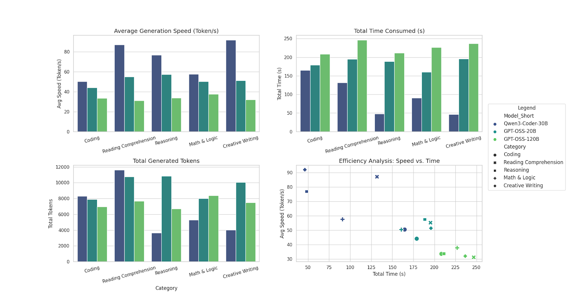

### 核心测试数据对比分析
三个模型（Qwen3-Coder-30B-A3B-Instruct-FP8、gpt-oss-20b、gpt-oss-120b）均完成5个类别（编程问题、阅读理解和分析、常识和推理、数学和逻辑、创意写作）的测试，**成功请求数均为5/5**，无失败案例。

#### 1. 整体生成速度排名（按平均生成速度均值排序）
- 第1名：Qwen3-Coder-30B-A3B-Instruct-FP8（均值72.73 Token/秒）
- 第2名：gpt-oss-20b（均值51.65 Token/秒）
- 第3名：gpt-oss-120b（均值33.17 Token/秒）

#### 2. 各类别速度亮点与差异
- **创意写作**：Qwen3-Coder-30B-A3B-Instruct-FP8以91.91 Token/秒遥遥领先，是gpt-oss-20b（51.28 Token/秒）的1.79倍、gpt-oss-120b（31.92 Token/秒）的2.88倍。
- **阅读理解和分析**：Qwen3-Coder-30B-A3B-Instruct-FP8（87.01 Token/秒）优势显著，远超另外两个模型。
- **编程问题**：Qwen3-Coder-30B-A3B-Instruct-FP8（50.36 Token/秒）> gpt-oss-20b（44.00 Token/秒）> gpt-oss-120b（33.48 Token/秒），差距相对均衡。
- **数学和逻辑**：gpt-oss-120b（37.70 Token/秒）虽整体最慢，但该类别表现优于自身其他类别，Qwen3-Coder-30B-A3B-Instruct-FP8（57.53 Token/秒）仍居首。
- **性能波动**：gpt-oss-120b波动最大（如阅读理解和分析速度11.56~38.89 Token/秒），Qwen3-Coder-30B-A3B-Instruct-FP8速度更稳定。

#### 3. 关键结论
Qwen3-Coder-30B-A3B-Instruct-FP8在所有测试类别中生成速度均领先，尤其在创意写作、阅读理解和分析场景优势突出；gpt-oss-20b表现中等且均衡；gpt-oss-120b整体速度最慢但数学和逻辑类别相对亮眼，且各场景波动较大。

### 三个模型多角度性能测试详细对比表格

| 模型名称                          | 测试类别         | 平均生成速度(Token/秒) | 总生成速度(Token/秒) | 总生成Token | 总耗时(秒) | 成功请求数 |
|-----------------------------------|------------------|------------------------|----------------------|-------------|------------|------------|
| Qwen3-Coder-30B-A3B-Instruct-FP8  | 编程问题         | 50.36                  | 50.35                | 8295        | 164.73     | 5/5        |
| Qwen3-Coder-30B-A3B-Instruct-FP8  | 阅读理解和分析   | 87.01                  | 88.14                | 11622       | 131.85     | 5/5        |
| Qwen3-Coder-30B-A3B-Instruct-FP8  | 常识和推理       | 76.85                  | 75.82                | 3653        | 48.18      | 5/5        |
| Qwen3-Coder-30B-A3B-Instruct-FP8  | 数学和逻辑       | 57.53                  | 58.34                | 5290        | 90.67      | 5/5        |
| Qwen3-Coder-30B-A3B-Instruct-FP8  | 创意写作         | 91.91                  | 86.82                | 4009        | 46.18      | 5/5        |
| gpt-oss-20b                       | 编程问题         | 44.00                  | 44.15                | 7903        | 179.02     | 5/5        |
| gpt-oss-20b                       | 阅读理解和分析   | 55.12                  | 55.12                | 10768       | 195.37     | 5/5        |
| gpt-oss-20b                       | 常识和推理       | 57.47                  | 57.40                | 10824       | 188.58     | 5/5        |
| gpt-oss-20b                       | 数学和逻辑       | 50.39                  | 49.80                | 7992        | 160.48     | 5/5        |
| gpt-oss-20b                       | 创意写作         | 51.28                  | 51.28                | 10046       | 195.91     | 5/5        |
| gpt-oss-120b                      | 编程问题         | 33.48                  | 33.50                | 6979        | 208.33     | 5/5        |
| gpt-oss-120b                      | 阅读理解和分析   | 31.11                  | 31.05                | 7659        | 246.70     | 5/5        |
| gpt-oss-120b                      | 常识和推理       | 33.66                  | 31.78                | 6713        | 211.21     | 5/5        |
| gpt-oss-120b                      | 数学和逻辑       | 37.70                  | 36.99                | 8393        | 226.89     | 5/5        |
| gpt-oss-120b                      | 创意写作         | 31.92                  | 31.67                | 7496        | 236.65     | 5/5        |

